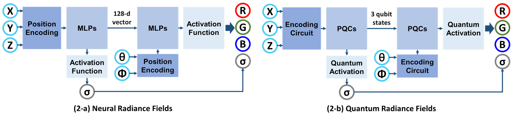
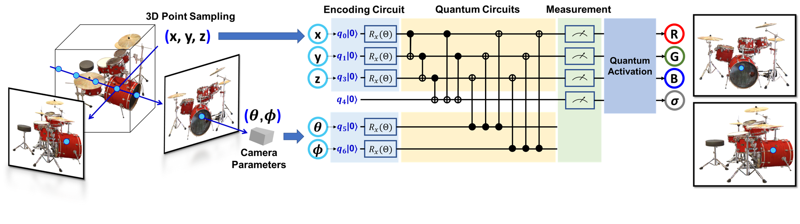
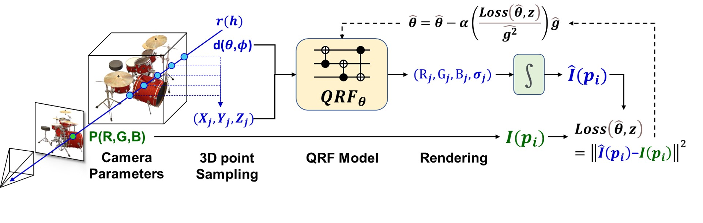

## QRF: Implicit Neural Representations with Quantum Radiance Fields
[Paper](https://arxiv.org/abs/2211.03418) | [Project Page](https://rossi-laboratory.github.io/QRF/) | [Vedio]() | [Code](https://github.com/Rossi-Laboratory/QRF/)

## NeRF vs QRF
* NeRF: given a 3D position (x, y, z), viewing direction (θ, ϕ), NeRF produces static and transient colors (r, g, b) and transparency values (σ).
* QRF: architecture replaces the same task with encoding circuit, parameterized quantum circuits, and quantum activation.

## QRF Architecture
* Quantum Radiance Fields (QRF) with encoding circuits and quantum circuits produces colors (r, g, b) and transparency values (σ) given a 3D position (x, y, z) and viewing direction (θ, ϕ). Similar to the NeRF architecture, QRF enforces that the predicted σ is independent of view direction. Note that this schematic is a simplified quantum circuit with only 4 rotation gates around the z axis.

## Optimization
* We supervise our QRF model by gradient descent using a simple 𝐿2 loss, and use Adam optimizer with a learning rate parameter α=0.001 to keep track of gradient moments over time to redirect the optimization trajectory.

